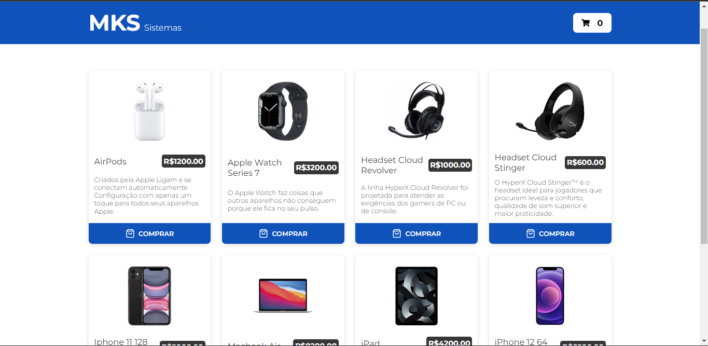

# mks-frontend-challenge
One frontend Challenge made by MKS to approve skills of candidates to job.
Made with: **NextJS**, **Redux** and **styled-components**



## Technologies
- NextJS
- Redux
- Styled-components
- Redux-saga

## Setup
To run this project, install it locally using yarn:

```
$ cd ../mks-frontend-challenge
$ yarn
$ yarn dev
```
